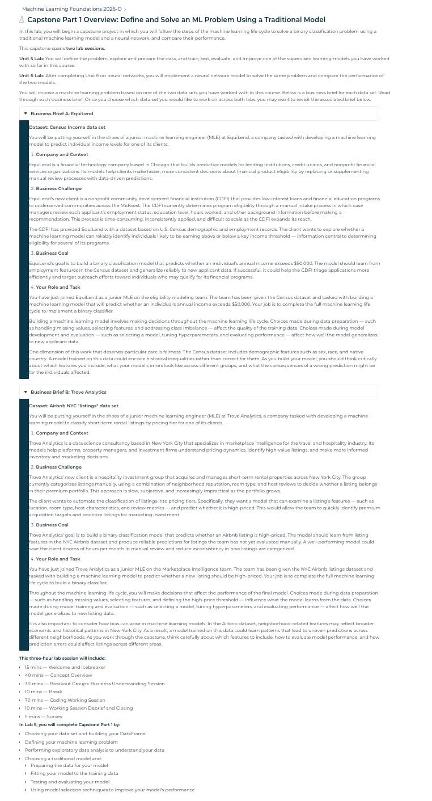
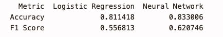
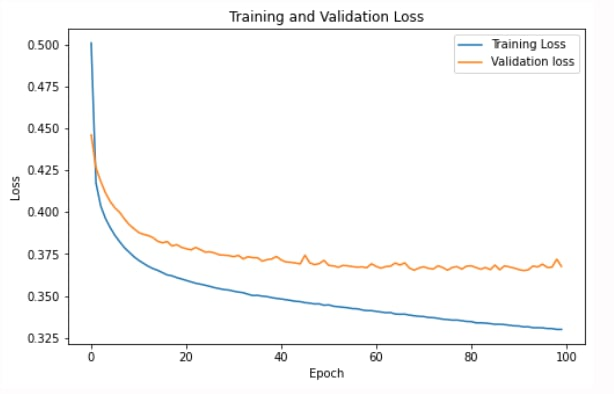
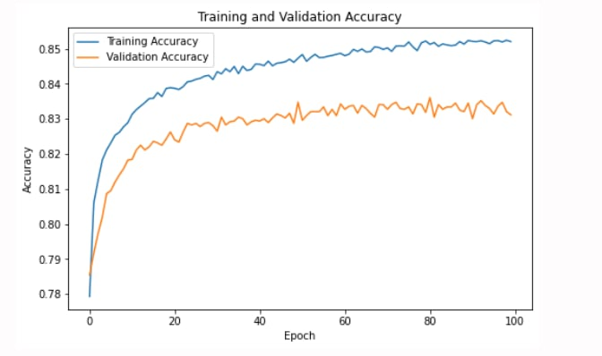

# 🏡 Airbnb Price Classification using Machine Learning

> **An end-to-end machine learning project comparing Logistic Regression and Neural Networks to classify Airbnb listings into high- and low-price categories.**


---



---

# 📖 Overview

This project was completed through the **Break Through Tech AI Machine Learning Foundations** program.

Acting as a **Junior Machine Learning Engineer** for **Trove Analytics**, I developed and evaluated machine learning models capable of predicting whether an Airbnb listing belongs to a **high-price** or **low-price** category.

The project demonstrates the complete machine learning workflow—from business understanding and exploratory data analysis to feature engineering, model development, evaluation, and business recommendations.

---

# ⭐ Project Highlights

- 🧠 Compared **Logistic Regression** and **Neural Networks**
- 📊 Analyzed **28,000+ Airbnb listings**
- ⚙️ Optimized Logistic Regression using **GridSearchCV**
- 🤖 Built a Neural Network using **TensorFlow/Keras**
- 📈 Achieved **83.3% Accuracy**
- 🎯 Improved **F1 Score from 0.557 → 0.621**
- 💼 Delivered business-focused recommendations based on model performance

---

# 💼 Business Problem

### Company

**Trove Analytics**

### Role

**Junior Machine Learning Engineer**

### Objective

Develop a binary classification model capable of predicting whether an Airbnb listing belongs to a **high-price** or **low-price** category.

### Business Value

- Reduce manual review time
- Improve pricing consistency
- Identify premium listings faster
- Support hospitality investment decisions

---

# 🚀 Machine Learning Workflow

```text
Business Understanding
        ↓
Exploratory Data Analysis
        ↓
Data Cleaning
        ↓
Feature Engineering
        ↓
Train/Test Split
        ↓
Feature Scaling
        ↓
Logistic Regression
        ↓
GridSearchCV
        ↓
Neural Network
        ↓
Model Evaluation
        ↓
Business Recommendation
```

---

# 🛠 Technology Stack

| Programming | Machine Learning | Data Analysis | Visualization |
|--------------|-----------------|--------------|---------------|
| Python | Scikit-learn | Pandas | Matplotlib |
| NumPy | TensorFlow | Jupyter Notebook | Seaborn |
| Keras | | | |

---

# 📊 Dataset

| Attribute | Value |
|------------|------|
| Dataset | Airbnb NYC Listings |
| Records | 28,000+ Listings |
| Problem Type | Binary Classification |
| Target Variable | Price Category (High vs. Low) |

---

# 📈 Model Performance

| Model | Accuracy | F1 Score |
|---------|---------:|---------:|
| Logistic Regression | **81.1%** | **0.557** |
| 🧠 Neural Network | **83.3%** | **0.621** |

The neural network achieved the strongest overall performance, outperforming Logistic Regression on both Accuracy and F1 Score.



---

# 📉 Training Performance

## Training & Validation Loss



The training and validation loss decreased steadily throughout training while remaining closely aligned, indicating stable learning and minimal overfitting.

---

## 📈 Training & Validation Accuracy



Training and validation accuracy improved consistently across epochs with only a small gap between the curves, suggesting strong generalization to unseen data.

---

# 🎯 Skills Demonstrated

### Machine Learning

- Logistic Regression
- Neural Networks
- TensorFlow
- Keras
- Scikit-learn
- GridSearchCV

### Data Science

- Exploratory Data Analysis (EDA)
- Data Cleaning
- Feature Engineering
- Feature Scaling
- Model Evaluation
- Binary Classification

### Programming

- Python
- Pandas
- NumPy
- Jupyter Notebook

### Business

- Data-Driven Decision Making
- Model Comparison
- Business Recommendations
- Technical Communication

---

# 💡 Business Recommendation

Although Logistic Regression produced strong baseline performance, the Neural Network achieved the highest overall predictive performance with:

- **Accuracy:** **83.3%**
- **F1 Score:** **0.621**

While the Neural Network required additional computational resources and was less interpretable, the improved predictive performance justified the increased complexity for this business problem.

---

# 🔮 Future Improvements

Potential future enhancements include:

- Implement Random Forest and XGBoost models
- Address class imbalance using resampling techniques
- Perform additional feature engineering
- Build an interactive prediction web application
- Evaluate performance on unseen production datasets

---

# 📂 Repository Structure

```text
airbnb-price-classification-ml/
│
├── Airbnb_Price_Classification.ipynb
├── README.md
├── airbnbData_train.csv
├── airbnb_model.pkl
│
└── images/
    ├── business-brief.jpeg
    ├── training-loss.jpeg
    ├── training-accuracy.jpeg
    └── model-results.jpeg
```

---

# 🎓 Learning Outcomes

Through this project, I gained hands-on experience applying the complete machine learning lifecycle to a real-world business problem.

Key areas of growth included:

- Exploratory Data Analysis (EDA)
- Data preprocessing and feature engineering
- Logistic Regression
- Neural Networks
- Hyperparameter tuning
- Model evaluation using Accuracy and F1 Score
- Translating technical findings into business recommendations

---

# 👩‍💻 About

**Maria Larson**

**B.S. Data Science | Applied AI | Machine Learning | Product Analytics**

Completed through the **Break Through Tech AI Machine Learning Foundations** program.

If you enjoyed this project, feel free to connect with me on LinkedIn or explore my other repositories showcasing machine learning, AI, and data science projects.
